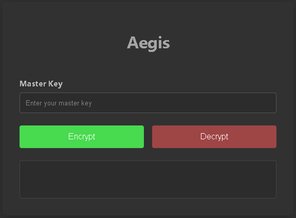

# Aegis: Secure File Encryption
Aegis is a simple, secure, and modern desktop application for encrypting and decrypting your files. Built with a clean user interface, it provides powerful AES-256-GCM encryption to protect your sensitive data locally.
Note: This project is for educational and personal use. While it uses strong cryptographic primitives, it has not undergone a formal security audit.

